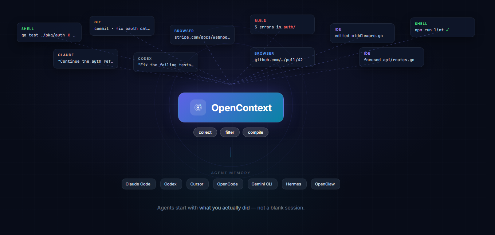

<p align="center">
  
</p>

<p align="center">
  <a href="https://github.com/ohmyctx/opencontext/releases">
    
  </a>
  <a href="https://www.npmjs.com/package/@ohmyctx/opencontext">
    
  </a>
  <a href="https://www.npmjs.com/package/@ohmyctx/opencontext">
    
  </a>
  <a href="https://github.com/ohmyctx/opencontext/blob/main/LICENSE">
    
  </a>
</p>

<p align="center">
  <a href="./README.md">English</a> · <a href="./README.zh-CN.md">中文</a>
</p>

<p align="center">
  <a href="INSTALL.md">Agent 安装指南</a> ·
  <a href="config.example.yaml">配置参考</a> ·
  <a href="docs/PROTOCOL.md">协议文档</a> ·
  <a href="docs/COLLECTORS.md">Collector 文档</a>
</p>

<br>

<p align="center">
  <b>让每个 AI Agent 都能记住你实际做过什么。</b>
</p>

<p align="center">
  OpenContext 会采集你日常开发工具里的轻量信号，<br/>
  把它们存在本地，并生成 Agent 可直接读取的 Markdown 记忆文件，<br/>
  这样 Agent 不需要每次都问你「刚才做了什么、上下文在哪里」。
</p>

<p align="center">
  
</p>

```text
你说："继续早上那个 auth refactor。"

没有 OpenContext：Agent 先问你改了什么、哪里失败、从哪个文件开始。
有 OpenContext：   Agent 可以先读 memory.md，看到最近命令、失败构建、
                  提交记录、当前项目和未完成事项。
```

## 为什么需要 OpenContext

AI 编程 Agent 很强大，但大多数情况下每次新会话都记不住上次聊了什么。OpenContext 为它们构建了一个本地活动层：

- Shell 命令、Agent 提示、IDE hooks 以及更多收集器的事件流入同一个本地事件存储
- 隐私等级决定记录什么、丢弃什么
- Subscription 决定哪些项目和来源会成为 Agent 可读的记忆
- `memory.md` 可以被 Claude Code、Cursor、Hermes、OpenClaw 等 Agent 引用

## AI Agent 安装（推荐）

> **最简单的方式** — 把下面这行发给 Claude Code 或任意 AI 编程 Agent，它会自动完成整个安装和配置：

```bash
Follow https://raw.githubusercontent.com/ohmyctx/opencontext/refs/heads/main/INSTALL.md to install and configure opencontext.
```

## 手动安装

### npm（推荐）

```bash
npm install -g @ohmyctx/opencontext
oc --version
```

### GitHub Releases

从 [GitHub Releases](https://github.com/ohmyctx/opencontext/releases) 下载对应平台的压缩包：

- `oc-v<version>-darwin-arm64.tar.gz`
- `oc-v<version>-darwin-amd64.tar.gz`
- `oc-v<version>-linux-arm64.tar.gz`
- `oc-v<version>-linux-amd64.tar.gz`
- `oc-v<version>-windows-amd64.zip`

```bash
# Linux amd64
curl -L -o oc https://github.com/ohmyctx/opencontext/releases/latest/download/oc-v<version>-linux-amd64.tar.gz
tar -xzf oc-*.tar.gz
./oc --version
```

### 源码编译

需要 Go 1.22+：

```bash
git clone https://github.com/ohmyctx/opencontext.git
cd opencontext
make build
./bin/oc --version
```

## 快速开始

启动守护进程：

```bash
oc daemon
```

另开一个终端：

```bash
oc status
oc collector shell install
source ~/.zshrc    # bash 用户用 ~/.bashrc
```

创建 `~/.opencontext/config.yaml` — 完整配置参考见 [`config.example.yaml`](config.example.yaml)：

```yaml
subscriptions:
  - name: "global"
    filter:
      sources: ["shell", "claude", "codex", "cursor", "opencode"]
      max_sensitivity: 2
    memory:
      backend: "raw_dump"
      path: "~/.opencontext/memory.md"
    refresh_interval: 300
```

编译一次并验证：

```bash
oc compile
cat ~/.opencontext/memory.md
```

常驻后台运行：

```bash
oc daemon install
oc daemon status
```

macOS 使用 launchd，Linux 优先用 systemd，没有 systemd 的环境（WSL/容器）自动降级为 pidfile 后台进程。

## Collectors

| 来源 | 安装命令 | 说明 |
|---|---|---|
| Shell | `oc collector shell install` | zsh/bash 命令历史，含隐私过滤 |
| Claude Code | `oc collector claude install` | 安装 Claude Code HTTP hooks |
| Codex | `oc collector codex install` | 安装 Codex hook adapter |
| Cursor | `oc collector cursor install` | 安装 Cursor hook adapter |
| OpenCode | `oc collector opencode install` | 安装 OpenCode hook adapter |
| Chrome 浏览器 | `oc collector browser-chrome install` | 可选扩展，需从 `chrome://extensions` 手动加载 |
| Firefox 浏览器 | `oc collector browser-firefox install` | 可选扩展，适用于 Firefox |
| Edge 浏览器 | `oc collector browser-edge install` | 可选扩展，适用于 Edge |
| macOS 活动 | 见 [Collector 安装指南](docs/COLLECTOR_INSTALL.md) | 可选外部 collector，需 Accessibility 权限 |
| Windows 活动 | 见 [Collector 安装指南](docs/COLLECTOR_INSTALL.md) | 可选外部 collector，可前台运行或接入任务计划 |

用 `oc collectors list` 和 `oc collectors info <name>` 查看 collector manifest、版本、事件来源、安装命令和 schema 引用。

## 隐私等级

| 等级 | 默认 | 内容 |
|---|---:|---|
| L1 | 开启 | app 名、命令名、git repo、URL 域名 |
| L2 | 用户选择开启 | 完整命令参数、commit message、完整 URL |
| L3 | 关闭 | 键盘输入、完整聊天内容、截图 |

Shell collector 不会记录以空格开头的命令。

## License

MIT